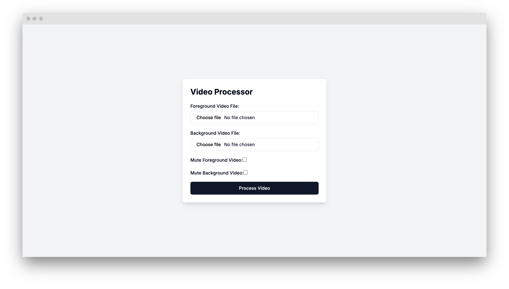

# Video Processor

Video Processor is a web application designed to allow users to combine a foreground video with a background video using browser-based video processing. The application uses FFmpeg to handle video manipulation directly in the browser, eliminating the need for any local software installation.

## Screenshot

## Motivation

The project was developed to provide an accessible and easy-to-use tool for combining and processing videos without the need for advanced video editing software. It aims to help content creators, marketers, and anyone needing to overlay videos quickly and efficiently, right from their web browser.

## Features
- Overlay a foreground video onto a background video.

- Option to mute the audio of either the foreground or background video.

- Operates directly in the browser using FFmpeg, without requiring local software.

- Simple and intuitive user interface for video uploads and settings configuration.

## Installation 
To set up the project locally:
 
1. Clone the repository using `git clone <repository-url>`.
 
2. Navigate to the project directory with `cd video-processor`.
 
3. Install the necessary dependencies with `npm install`.

## Usage
1. Upload your foreground and background videos using the file input fields provided.

2. Adjust audio settings if needed, by muting either the foreground or background video.

3. Click "Process Video" to combine the videos. The resulting video will be available for download once processing is complete.

## Development
To run the development server:
 
- Execute `npm run dev`.

To build the application for production:
 
- Run `npm run build`.

To start the production server:
 
- Use `npm run start`.

## Contributing 
Contributions are welcome. You can open issues or submit pull requests for improvements or bug fixes.

## License 
This project is licensed under the MIT License. See the LICENSE file for details.
